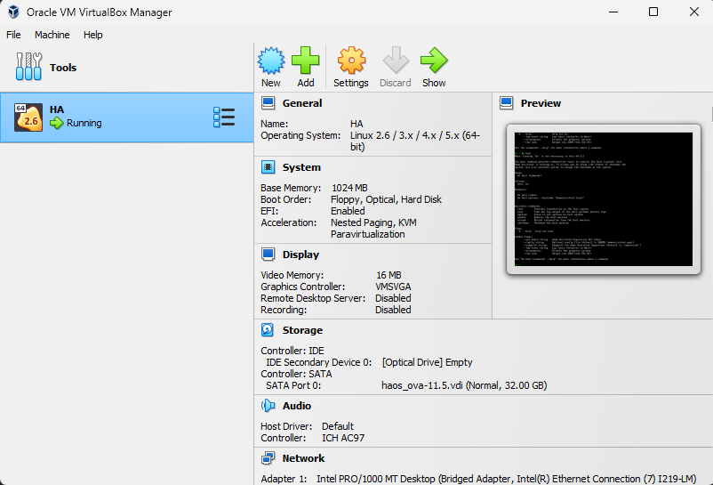
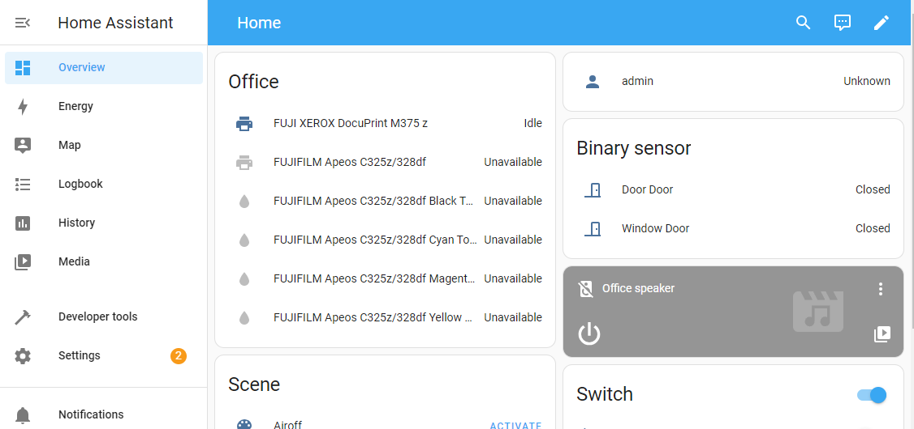

# Smart Home

## Add TTS to automation

Settings/Automation/Create automation/Create new automation
- When/Time
- Then do/Text-to-speech (TTS): Speak
  - Targets/Google en com
  - Entity/Office speaker
  - Message/"hahaha"
  - Cache/on
  - Language/Unchecked

## MacOS

### [Home Asssistant](https://www.home-assistant.io/)
Manage all devices in one place

1. Run [UTM](https://mac.getutm.app/)(Virutal machines for Mac)
2. Run HA
3. Web interface : http://homeassistant.local:8123/

###  [Homebridge](https://homebridge.io/)

Connect non-HomeKit devices to HomeKit

`sudo hb-service [start|stop|restart]`

- Web interface : http://localhost:8581/

## Windows

### [Home Asssistant](https://www.home-assistant.io/)
Manage all devices in one place

1. Run [VirtualBox](https://www.virtualbox.org/)(Virutal machines for Windows)

2. Run HA
3. Web interface : http://homeassistant.local:8123/

